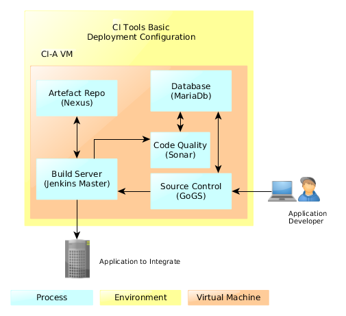

## CI Tools BASIC Blueprint

Basic is a 1-VM blueprint as follows:

### Build CI Tools Basic Blueprint

To build the CI Tools basic blueprint, use the CI Tools Bronze blueprint, and in the [inventory.txt](../bonze/inventory.txt) file either set the `ci_a_ip` and `ci_b_ip` parameters to the same IP address or set the *ci_b_ip* parameter as follows:

 `ci_b_ip={{ci_a_ip}}`
