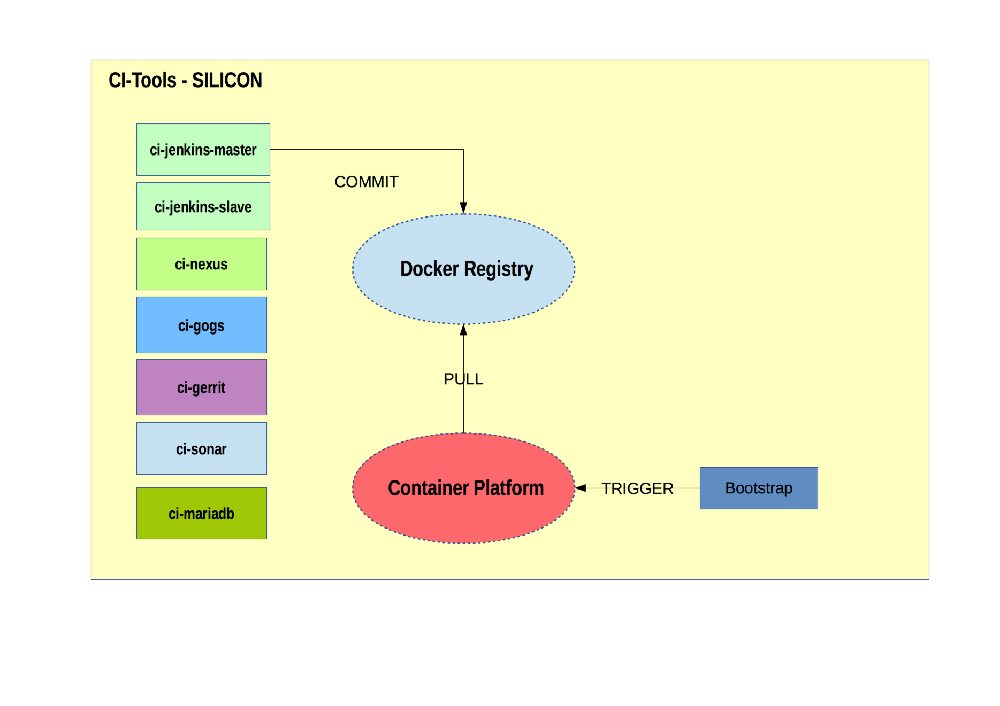

## CITOOLS - SILICON Blueprint

Silicon is a blueprint for container orchestration engines. Each service is deployed in its own docker image. 
Images are deployed by the orchestration engine from a central registry following the configuration in a template.

